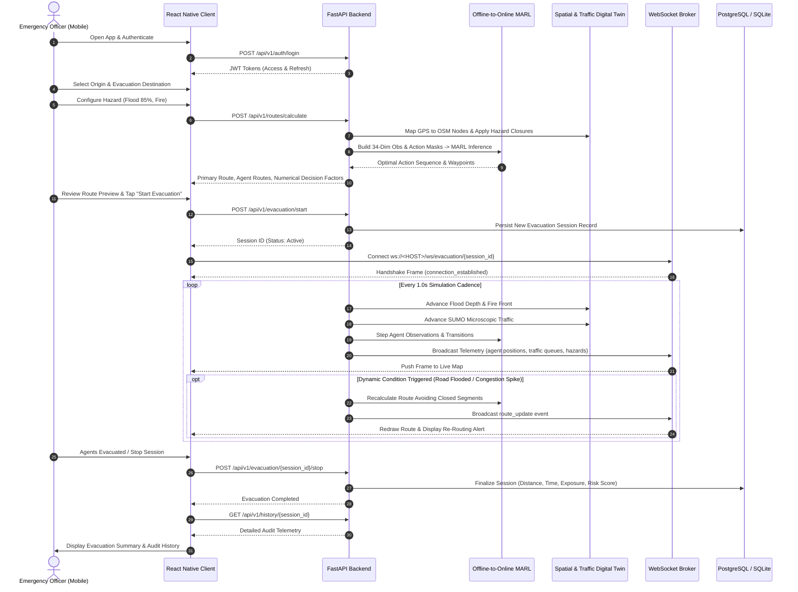

# End-to-End Operational Lifecycle & Sequence Flow

## Visual Sequence Diagram

```mermaid
sequenceDiagram
    autonumber
    actor Officer as Emergency Officer (Mobile)
    participant Client as React Native Client
    participant API as FastAPI Backend
    participant Model as Offline-to-Online MARL
    participant Twin as Spatial & Traffic Digital Twin
    participant WS as WebSocket Broker
    participant DB as PostgreSQL / SQLite

    Officer->>Client: Open App & Authenticate
    Client->>API: POST /api/v1/auth/login
    API-->>Client: JWT Tokens (Access & Refresh)
    Officer->>Client: Select Origin & Evacuation Destination
    Officer->>Client: Configure Hazard (Flood 85%, Fire)
    Client->>API: POST /api/v1/routes/calculate
    API->>Twin: Map GPS to OSM Nodes & Apply Hazard Closures
    API->>Model: Build 34-Dim Obs & Action Masks -> MARL Inference
    Model-->>API: Optimal Action Sequence & Waypoints
    API-->>Client: Primary Route, Agent Routes, Numerical Decision Factors
    Officer->>Client: Review Route Preview & Tap "Start Evacuation"
    Client->>API: POST /api/v1/evacuation/start
    API->>DB: Persist New Evacuation Session Record
    API-->>Client: Session ID (Status: Active)
    Client->>WS: Connect ws://<HOST>/ws/evacuation/{session_id}
    WS-->>Client: Handshake Frame (connection_established)

    loop Every 1.0s Simulation Cadence
        API->>Twin: Advance Flood Depth & Fire Front
        API->>Twin: Advance SUMO Microscopic Traffic
        API->>Model: Step Agent Observations & Transitions
        API->>WS: Broadcast Telemetry (agent positions, traffic queues, hazards)
        WS-->>Client: Push Frame to Live Map
        opt Dynamic Condition Triggered (Road Flooded / Congestion Spike)
            API->>Model: Recalculate Route Avoiding Closed Segments
            API->>WS: Broadcast route_update event
            WS-->>Client: Redraw Route & Display Re-Routing Alert
        end
    end

    Officer->>Client: Agents Evacuated / Stop Session
    Client->>API: POST /api/v1/evacuation/{session_id}/stop
    API->>DB: Finalize Session (Distance, Time, Exposure, Risk Score)
    API-->>Client: Evacuation Completed
    Client->>API: GET /api/v1/history/{session_id}
    API-->>Client: Detailed Audit Telemetry
    Client->>Officer: Display Evacuation Summary & Audit History
```
